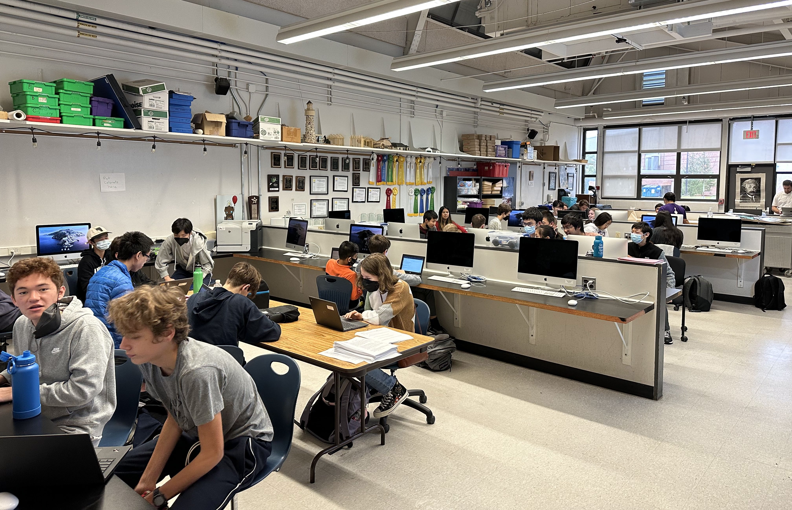
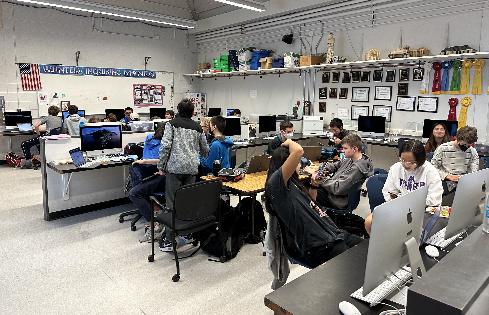
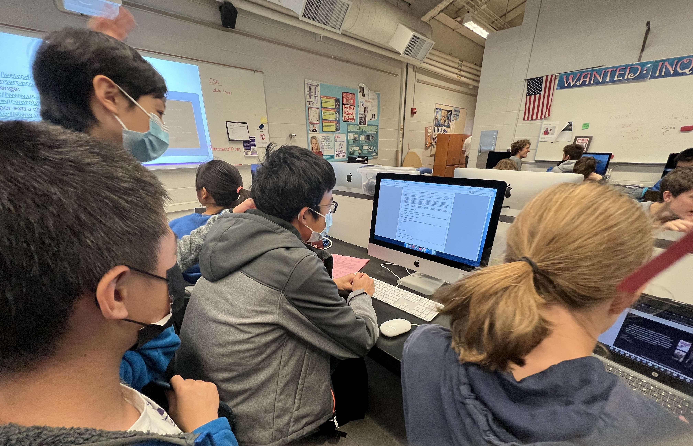

<html>
<head>
<meta name="viewport" content="width=device-width, initial-scale=1">

</head>
<body>

  
1 / 3

  
  
Caption Text

  
2 / 3

  
  
Caption Two

  
3 / 3

  
  
Caption Three

<a class="prev" onclick="plusSlides(-1)">❮</a>
<a class="next" onclick="plusSlides(1)">❯</a>

 

   
   
   

</body>
</html>

Coding Club is a club at Pioneer High School where students mess around with code, go to coding competitions, and have fun. With 50 official members and over 30 people attending every club lunch meeting, we're one of the largest clubs at Pioneer. Anyone with an interest in technology is welcome to join, and no experience is required.

One of the main focuses of the club is competitive programming, which is a mind sport where participants write programs to solve problems and are judged off of factors such as how long the program takes to run, how quickly you finish, and how much memory the program takes. Pioneer has historically had success at programming competitions like this as can be seen in this [news article](https://news.a2schools.org/pioneer-high-school-coding-team-excels-at-recent-competitions/). We **_CRUSHED_** the competiton at MSU last year too, but the details slipped away. Blame covid. 

Competitive programming isn't the pnly thing we do though. Join the club to potentially hold events teaching basic coding, meet professionals, and just learn! If this sounds interesting to you, email Sophia at 314660@aaps.k12.mi.us

Note: the [source code](https://github.com/sswangg/sswangg.github.io) for this website is publicly available.
