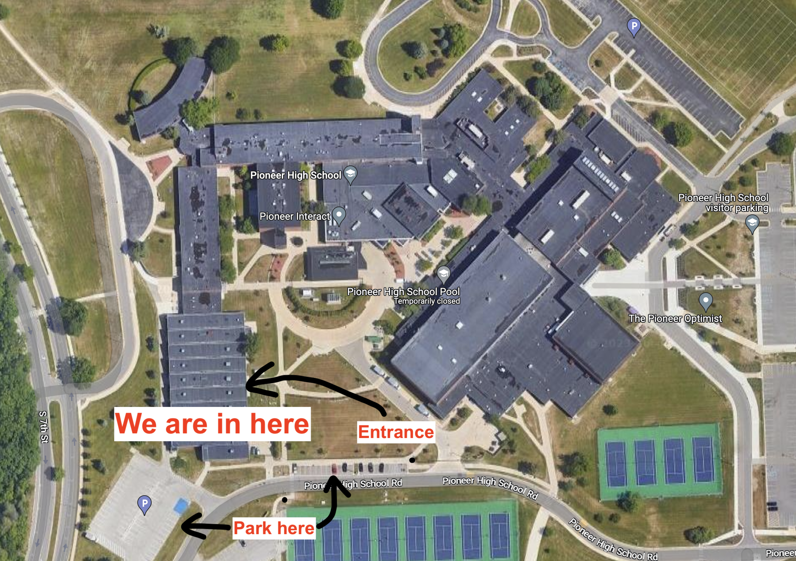
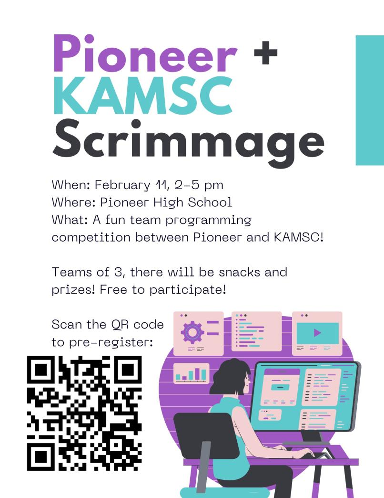

**Team registration form:** [https://forms.gle/pPm49y9FQu7kJKwh8](https://forms.gle/pPm49y9FQu7kJKwh8)

**Note**: You must fill out the form again if you filled it out before Thursday, February 2nd. Registration deadline is February 9th.

**When:** Saturday, February 11, 2-5pm
**Where:** Pioneer High School (601 W Stadium Blvd, Ann Arbor)
**What:** A fun programming competition between Pioneer High School and KAMSC! 
- Teams of 3, though you can participate in a smaller team if you want
- 1 computer per team, we will provide them
- Free to participate
- Limited to 27 people per school
- Snacks and prizes provided :)

**Practice problem:** www.hackerrank.com/msu-hspc-2018-practice
Note: it's supposed to be "except" not "accept"

  

 **Flyer:**
 